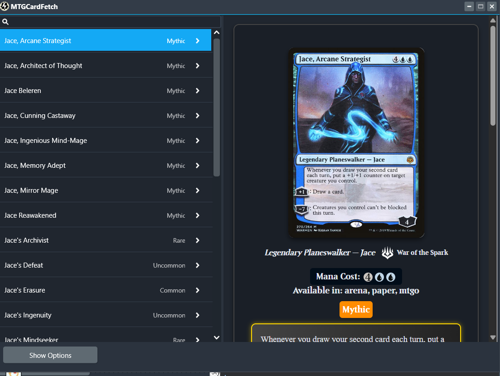
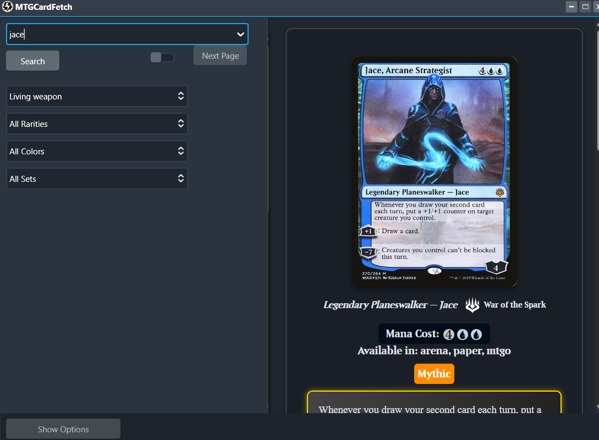

# MTG Fetcher

**MTG Fetcher** is a Delphi-based application designed to fetch and display Magic: The Gathering card information using the [Scryfall API](https://scryfall.com/docs/api). Whether you're a Magic: The Gathering enthusiast, deck builder, or developer, this tool provides an efficient way to search for cards, view details, and manage your collection.

👋 Hey! If you find this project interesting or have ideas, let me know by opening an issue or starting a discussion. I'd love to hear from you!

---

## **Features**

- **Card Search**:
  - Search cards by name, set, rarity, or color.
  - Supports advanced filtering for detailed results.

- **Card Display**:
  - View card details, including high-resolution images, mana cost, and set information.
  - Features a layout for displaying card collections.

- **User-Friendly Interface**:
  - Designed with a clean and responsive UI using FireMonkey for scalability.

- **Expandable**:
  - Built as a hobby project with opportunities for community collaboration and improvements.

---

## **Screenshots**




---

## **Getting Started**

### **Prerequisites**
To run or contribute to MTG Fetcher, you’ll need:
- **Delphi 12+** (Community Edition or higher).
- A basic understanding of Delphi programming (optional for non-developers).
- Internet connection for API requests.

---

## **Setup Instructions**

### **1. Clone the Repository**  
```bash
git clone https://github.com/Raygunpewpew1/MTG-Fetcher.git
```

### **2. Install Required Libraries**
- [`JsonDataObjects`](https://github.com/ahausladen/JsonDataObjects)

### **3. Install WebView2 SDK (Required for UI Rendering)**
- Open Delphi and go to **Tools > GetIt Package Manager**.  
- Search for **WebView2 SDK** and install it.  
- This ensures you have the correct `WebView2Loader.dll` that **Delphi’s WebView2 component requires**.

### **4. Configure the Project**
- Open the project in Delphi.
- Ensure all necessary paths and libraries are correctly set up.

### **5. Verify WebView2Loader.dll Deployment**
The correct `WebView2Loader.dll` must be included in your project's output folder (`Win64\Debug\` or `Win64\Release\`).  

- If missing, manually copy it from:  
  ```
  C:\Users\yourusername\Documents\Embarcadero\Studio\23.0\CatalogRepository\EdgeView2SDK-*\Bin\x64\WebView2Loader.dll
  ```
### **6. Run the Application**
- Compile and execute the project on Windows.

---

## **How to Use**

1. Launch the app and enter your search query (e.g., card name, set code).
2. Apply filters for rarity, color, or other attributes to refine results.
3. View the results in a list format or a visually appealing card layout.

---

## **Contributing**

Contributions are welcome! Here’s how you can help:

- **Report Issues**: Found a bug? Let us know by opening an issue.
- **Suggest Features**: Have an idea to improve the app? Submit a feature request.
- **Code Contributions**: Fork the repository, make your changes, and submit a pull request.
- **Help with Documentation**: Improve setup instructions, add examples, or clarify usage.

### **Looking for Help With:**
- Improving the user interface (e.g., better card layouts, animations).
- Adding new features like deck building or offline caching.
- Optimizing performance and API integration.
- Database integration for saving the card collection.

---

## **Acknowledgments**

- Card data and images are fetched using the [Scryfall API](https://scryfall.com/docs/api).
- Magic: The Gathering is a trademark of **Wizards of the Coast**. This project is not affiliated with or endorsed by Wizards of the Coast.

---

## **Why WebView2Loader.dll from GetIt Is Required**
- The WebView2Loader.dll from the **GetIt SDK** is required because **Delphi's WebView2 implementation is tied to that version**.
- Using a system-installed WebView2Loader.dll **may cause crashes or incompatibility issues**.
- This ensures that all contributors use the correct DLL version.

---

## **License**

This project is licensed under the MIT License. See the [LICENSE](LICENSE) file for details.

---

## **Contact**

Have questions or suggestions? Feel free to reach out or open an issue. Every bit of help is appreciated!